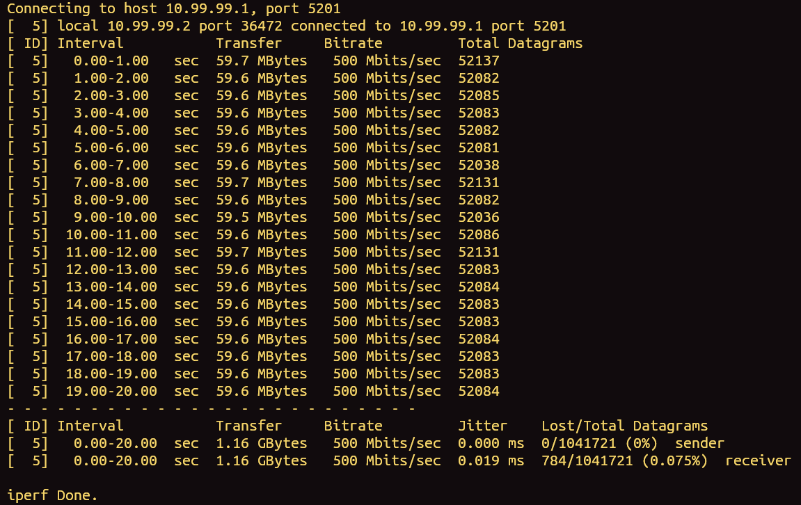
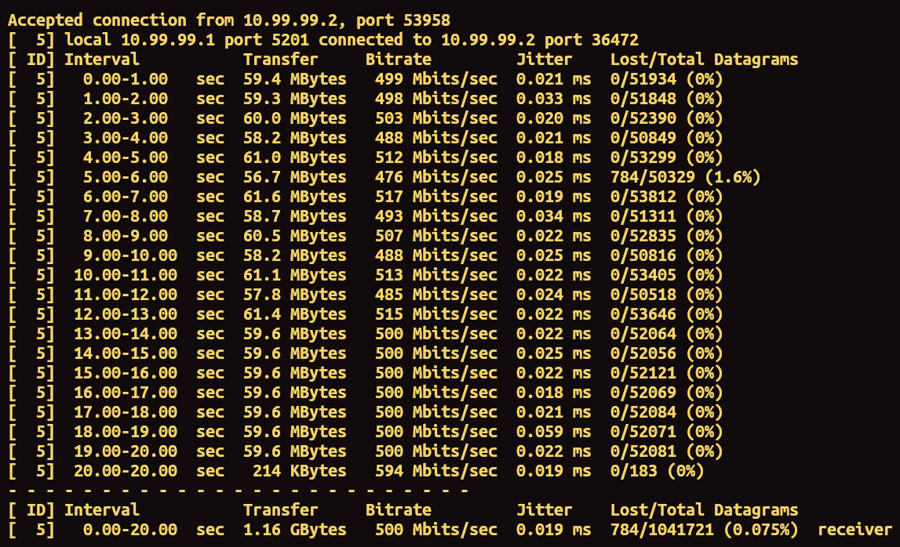

# micro — secure high-speed tunnel over UDP


# What is micro?

**micro** is a simple, L3 UDP tunneling engine written in Go, micro uses TUN interfaces for read/write L3 traffic.

# Simple start

Create a valid configs for server and client. Default configs already created and placed if cfg folders. Firstly start a server, then a client (at the now version client and server can has connectivity problem - just restart server and client).

```
chmod +x server
sudo ./server
```

```
chmod +x client
sudo ./client
```

# iperf3 test (500 Mbps)

## Client side



## Server side

